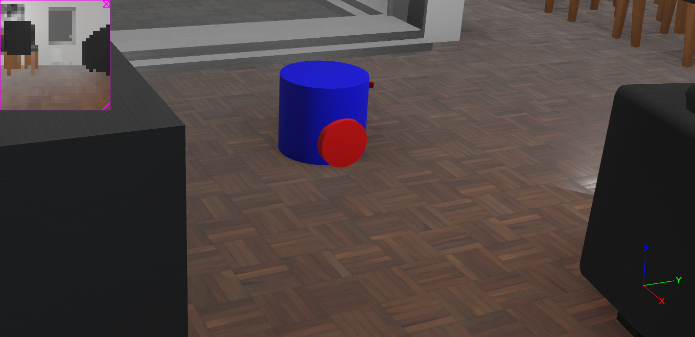

# Two-Wheeler Robot Project

This repository contains a simulation of a two-wheeled robot that can be controlled inside a virtual apartment environment using the Webots robotics simulator.



## Robot Description

The robot is a simple two-wheeled differential drive platform with the following features:

- Two motorized wheels for movement and steering
- Differential drive system (independent control of each wheel)
- Integrated camera for visual sensing
- Keyboard control interface for manual navigation

The robot uses a differential drive control scheme:
- Forward motion: Both wheels rotate forward
- Backward motion: Both wheels rotate backward
- Left turn: Right wheel rotates forward, left wheel rotates backward
- Right turn: Left wheel rotates forward, right wheel rotates backward

## Prerequisites

- Webots robotics simulator (R2023a or later recommended)
- Python 3.6+

## Installation

### 1. Install Webots

1. Visit the [Webots download page](https://cyberbotics.com/#download) and download the appropriate version for your operating system.
2. Follow the installation instructions for your platform:
   - **Windows**: Run the installer and follow the prompts
   - **macOS**: Drag the Webots app to your Applications folder
   - **Linux**: Follow the package installation instructions for your distribution

### 2. Clone this Repository

```bash
git clone https://github.com/Davidwarchy/apartment-manual-drive.git
cd apartment-manual-drive
```

## Running the Simulation

### Method 1: Directly Open the World File

1. Navigate to the `worlds` folder
2. Double-click on `complete_apartment.wbt`
3. The simulation will start automatically with the robot controller

### Method 2: From Webots

1. Start Webots
2. Select File > Open World
3. Navigate to and select `worlds/complete_apartment.wbt`
4. The simulation will load with the robot ready to control

## Controlling the Robot

Use the following keyboard controls to navigate the robot:

- **W or Up Arrow**: Move forward
- **S or Down Arrow**: Move backward
- **A or Left Arrow**: Turn left
- **D or Right Arrow**: Turn right

## Project Structure

```
apartment-manual-drive/
│   .gitignore
│   
├───.qodo
├───controllers
│   └───drive_robot
│       │   drive_robot.py
│       │   
│       └───__pycache__
│               collect.cpython-311.pyc
│               maze_env.cpython-311.pyc
│
└───worlds
        .complete_apartment.jpg
        complete_apartment.wbt
```

## Modifying the Robot Controller

The main robot controller is located at `controllers/drive_robot/drive_robot.py`. You can modify this file to change the robot's behavior, add new features, or implement autonomous navigation.

## License

This project is licensed under the MIT License - see the [LICENSE](LICENSE) file for details
